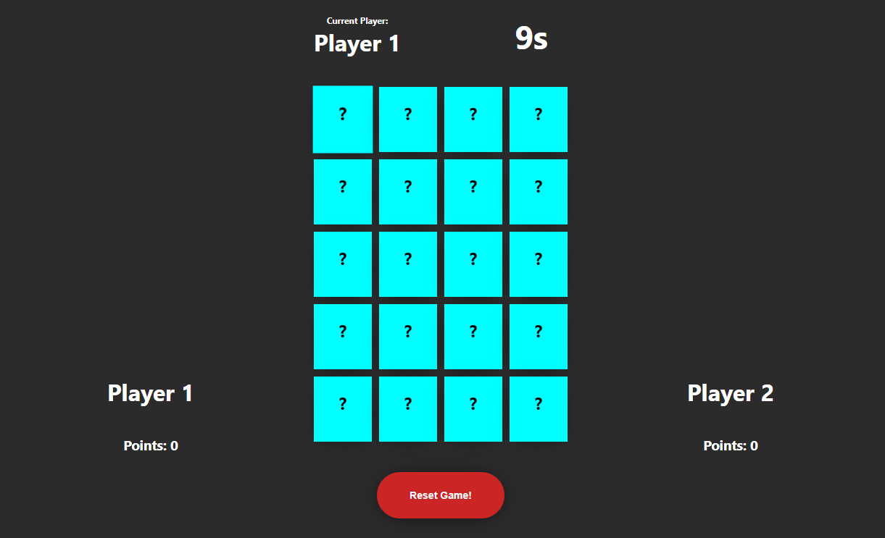

# React Memory Game
## You can see the demo [here!](https://memory-game-react-001.netlify.com/)

this is an implementation of react and redux to make a Memory Game!
in the "master" branch you can found the "not styled" version ( only the logic )
and the styled version ( image above ) in "stable_styled" branch 

in order to this to work:
clone the repo,

move inside the cloned folder, open a terminal and type:

yarn install or npm install
 
and then type:

yarn start or npm start

